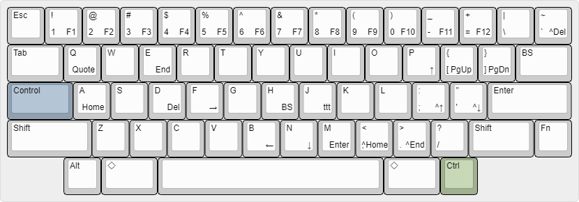

# wmacs-jis

Windows/Emacs compromise key bindings for JIS keyboard.


## Description

Wmacs is a set of keybindings designed for using Windows on JIS keyboard.
It aims to reduce difficulty for an Emacs/US keyboard user to work with Windows/JIS keyboard.

## Features

- US layout on JIS keyboard
- `無変換` and `変換` as `Ctrl` keys
- Windows standard shortcut keys, such as cut and paste, undo, etc.
- Emacs basic keybindings, such as cursor move, delete, etc.
- No administrator privileges required

## Requirement

- Windows 10
- [AutoHotkey](https://www.autohotkey.com/)

## Installation

```
$ git clone https://github.com/yoyuse/wmacs-jis
```

## Usage

Open `wmacs-jis\wmacs.ahk` with `AutoHotkey.exe`.

Or, copy `wmacs-jis` folder to the location where `AutoHotkey.ahk` exists, add following line to [Auto-execute section](http://www.autohotkey.com/docs/Scripts.htm#auto) of `AutoHotkey.ahk`:

```
#Include %A_LineFile%\..\wmacs-jis\wmacs.ahk
```

and run `AutoHotkey.exe`.

## Wmacs Keybindings

### US Layout on JIS Keyboard

| JIS | Wmacs | Notes |
|----|----|----|
| `半角/全角` | `` ` ``/`~` | ``Alt+` `` to toggle IME |
| `"` | `@` | `Shift+2` |
| `&` | `^` | `Shift+6` |
| `'` | `&` | `Shift+7` |
| `(` | `*` | `Shift+8` |
| `)` | `(` | `Shift+9` |
| `_` | `)` | `Shift+0` |
| `=` | `_` | `Shift+-` |
| `^`/`~` | `=`/`+` | |
| `@`/`` ` `` | `[`/`{` | |
| `[`/`{` | `]`/`}` | |
| `+` | `:` | `Shift+;` |
| `:`/`*` | `'`/`"` | |
| `]`/`}` | `\`/`\|` | |

### JIS Specific Keys

| JIS | Wmacs | Notes |
|----|----|----|
| `無変換` | `LCtrl` | Left `Ctrl` |
| `変換` | `RCtrl` | Right `Ctrl` |
| `英数` | Nop | Disabled |
| `カタカナひらがな` | `半角/全角` | Toggle IME |

### Windows Fragment

| Key | Meaning | Notes |
|----|----|----|
| `無変換-c` | `Ctrl+c` | Copy |
| `無変換-s` | `Ctrl+s` | Save |
| `無変換-v` | `Ctrl+v` | Paste |
| `無変換-x` | `Ctrl+x` | Cut |
| `無変換-y` | `Ctrl+y` | Redo |
| `無変換-z` | `Ctrl+z` | Undo |

### Emacs Fragment

| Key | Meaning | Notes |
|----|----|----|
| `無変換-a`/`e` | `Home`/`End` | Beginning/End of line |
| `無変換-b`/`f`/`n`/`p` | `←`/`→`/`↓`/`↑` | Left/Right/Down/Up |
| `無変換-d` | `Del` | Delete |
| `無変換-h` | `BS` | Back Space |
| `無変換-m` | `Enter` | Newline |
| `無変換-q` | quoted-insert | `無変換-q 無変換-f` to `Ctrl+F` etc. |

### Others

| Key | Meaning | Notes |
|----|----|----|
| `無変換-1`～`9`/`0`/`-`/`=` | `F1`～`F9`/`F10`/`F11`/`F12` | Function Keys |
| `無変換-[`/`]` | `PdUp`/`PgDn` | Previous/Next Page |
| `無変換-,`/`.` | `Ctrl+Home`/`End` | Beginning/End of Document |
| `無変換-;`/`'` | `Ctrl+↑`/`↓` | Line Scroll Down/Up |
| ``無変換-` `` | `Ctrl+Del` | Word Delete |
| `無変換-BS` | `Ctrl+BS` | Word Back Space |
| `S-無変換-;` | Date Stamp | *YYYY-mm-dd* format |
| `S-無変換-'` | Date Stamp | *yymmdd* format |
| `無変換-j` | [ttt](https://github.com/yoyuse/ttt) Conversion | TT-code Japanese Input |
| `無変換-Esc` | Reload | Reload `wmacs.ahk` |
| `無変換-`*key* | `Ctrl+`*key* | For Other Keys |

## Tips

### `無変換-q` (quoted-insert)

Wmacs remaps `無変換` to `LCtrl` (Left Ctrl) and overwrites some key combos with Emacs bindings etc.
`無変換-q` (quoted-insert) is for inputting the overwritten keys.

For example, you can input `Ctrl+F` (Find) by `無変換-q 無変換-f`, and `Ctrl+N` (New) by `無変換-q 無変換-n` and so on.

### `RCtrl`

Wmacs remaps `変換` to `RCtrl` (Right Ctrl), which is not affected by Wmacs.

For example, you can also input `Ctrl+F` by `変換-f`, and `Ctrl+N` by `変換-n` and so on.

### One Shot Modifier

Check `Use One Shot Modifier` option in the menu of Wmacs icon in the notification area (task tray) to use `無変換` or `変換` as one shot modifier.

With this option enabled, each of the two keys has its original function when the key is pressed and released without any key combo.

### Using Wmacs on HHKB (US Layout)



Wmacs is also available with US layout version of [HHKB](https://happyhackingkb.com/jp/), which does not have `無変換` or `変換`.

For the former key, you can use `Control` as `LCtrl`.

For the latter key, you can use `RAlt` as `RCtrl` by checking `Remap RAlt to RCtrl` option in the menu of Wmacs icon in the notification area (task tray).

### Using Wmacs with US Keyboard Driver

Check `Use 104 Keyboard Driver` option in the menu of Wmacs icon in the notification area (task tray).

## Author

[yoyuse](https://github.com/yoyuse)

## License

MIT
