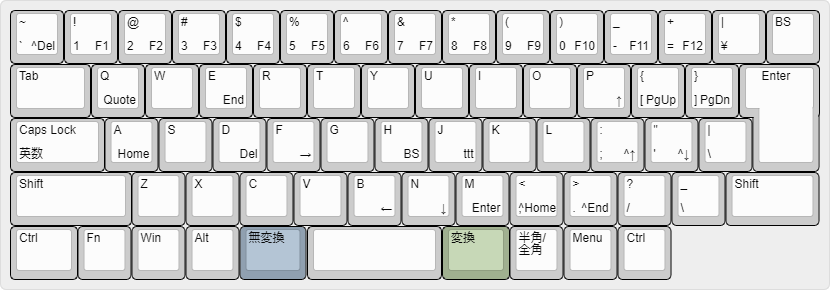

# wmacs-jis

Windows/Emacs compromise key bindings for JIS keyboard.

## wmacs-jis.ahk

wmacs-jis は、JIS キーボード用に作られた Windows 向けのキー配列です。

wmacs-jis 配列は、JIS キーボード上に US 配列を実現するとともに、 `無変換` キーをモディファイアとして使い、Windows の標準的なショートカットキー (カット&ペーストやアンドゥなど) と Emacs の基本的なキーバインド (カーソル移動や削除など) を、`無変換-`*key* に割り当てています。

## キーバインド一覧

| キー | 意味 | 備考 |
|----|----|----|
| `無変換-a`/`無変換-e` | `Home`/`End` | 行頭/行末 |
| `無変換-b`/`f`/`n`/`p` | `←`/`→`/`↓`/`↑` | カーソル移動 |
| `無変換-d` | `Del` | 削除 |
| `無変換-h` | `BS` | バックスペース |
| `無変換-m` | `Enter` | 改行 |
| `無変換-1`～`9`/`0`/`-`/`^` | `F1`～`F9`/`F10`/`F11`/`F12` | ファンクションキー |
| `無変換-@`/`無変換-[` | `PdUp`/`PgDn` | 前/次ページ |
| `無変換-,`/`無変換-.` | `C-Home`/`C-End` | ファイルの先頭/末尾 |
| `無変換-¥` | `C-n` | 新規作成 |
| `無変換-;` | `C-f` | 検索 |
| `無変換-:` | `C-h` | 置換 |
| `無変換-/` | `C-a` | 全選択 |
| `無変換-j` | [ttt](https://github.com/yoyuse/ttt) 変換 | TT-code 日本語入力 |
| `無変換-`*key* | `C-`*key* | その他の文字キー |
| `変換`-*key* | `C`-*key* | |
| `カタカナひらがな` | `半角/全角` | |
